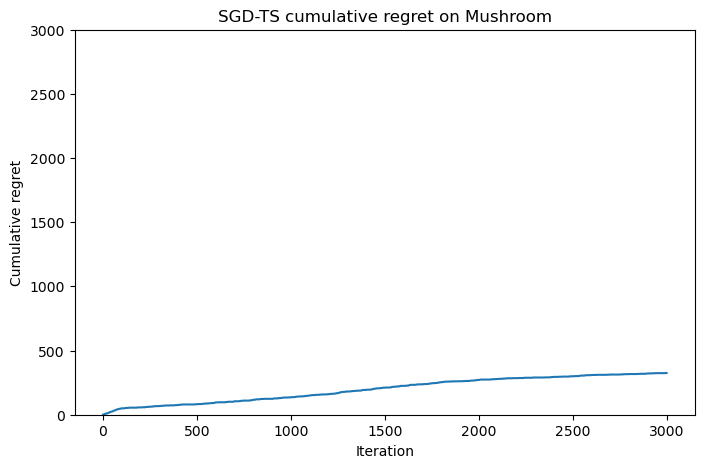

# SGD-TS
Implemented an algorithm for contextual bandits: Online Stochastic Gradient Descent and Thompson Sampling

The algorithm is written according to the article [An Efficient Algorithm For Generalized Linear Bandit: Online
Stochastic Gradient Descent and Thompson Sampling](https://arxiv.org/pdf/2006.04012)

The algorithm was trained on the [Mushrooms dataset](https://archive.ics.uci.edu/dataset/73/mushroom)

